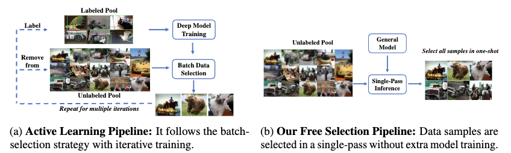
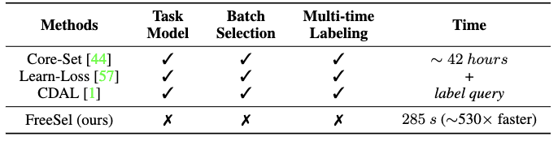
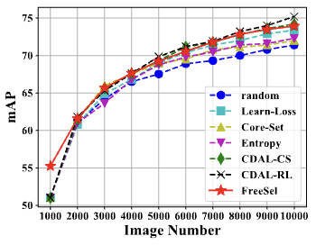

# Towards General and Efficient Active Learning
This repo is official code implementation for the paper "Towards General and Efficient Active Learning". You can find the paper on [arXiv](https://arxiv.org/abs/2112.07963). 

Existing active learning work follows a cumbersome pipeline by repeating the time-consuming model training and batch data selection multiple times on each dataset separately. We challenge this status-quo by proposing a novel general and efficient active learning (GEAL) method in this paper. Utilizing a publicly available model pre-trained on a large dataset, our method can conduct data selection processes on different datasets with a single-pass inference of the same model.

<div align="center">
    
</div>

Our method is significantly more efficient than prior arts by hundreds of times, while the performance is competitive or even better than methods following the traditional pipeline.
<div align="center">
    
</div>

<div align="center">
    
</div>


## Installation

This codebase has been developed with CUDA 11.2, python 3.7, PyTorch version 1.7.1, and torchvision 0.8.2.  Please install [PyTorch](https://pytorch.org/) according to the instruction on the official website, and run the following command to install other necessary modules.

```
pip install -r requirements.txt
```

## Data Selection

Please follow the steps in our [instruction](data_selection) for data selection.

## Downstream Tasks

+ **Object Detection**: Please follow the steps in our [instruction](downstream/detection) for object detection.

## Credits

+ The transformer backbone follows [dino](https://github.com/facebookresearch/dino).
+ The downstream object detection task code comes from [mmdetection](https://github.com/open-mmlab/mmdetection).

We sincerely thank the authors for their excellent work!

## Citation

If you find our research helpful, please consider cite it as:
```
@article{xie2021towards,
  title={Towards General and Efficient Active Learning},
  author={Xie, Yichen and Tomizuka, Masayoshi and Zhan, Wei},
  journal={arXiv preprint arXiv:2112.07963},
  year={2021}
}
```
