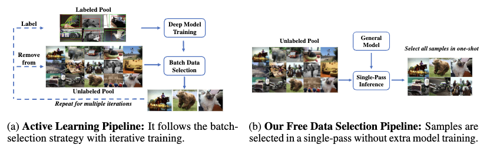

# Towards Free Data Selection with General-Purpose Models
This repo is official code implementation for our NeurIPS 2023 paper "Towards Free Data Selection with General-Purpose Models". Currently, this repository only contains the implementation for the old version paper: [Towards General and Efficient Active Learning](https://arxiv.org/abs/2112.07963). We will update the new version of paper and code soon.

## Update
+ [2023-9-21] 🔥Our paper is accepted by NeurIPS 2023!🔥
+ [2022-6-24] Code for image classification task is available.
+ [2022-3-20] An updated version of GEAL is released with better efficiency, stability, and performance.
+ [2022-2-23] Code for object detection task is available.

## TL;DR

Existing active learning work follows a cumbersome pipeline by repeating the time-consuming model training and batch data selection multiple times on each dataset separately. We challenge this status-quo by proposing a novel general and efficient active learning (GEAL) method in this paper. Utilizing a publicly available model pre-trained on a large dataset, our method can conduct data selection processes on different datasets with a single-pass inference of the same model.

<div align="center">
    
</div>

Our method is significantly more efficient than prior arts by hundreds of times, while the performance is competitive or even better than methods following the traditional pipeline.
<div align="center">
    
</div>

<div align="center">
    
</div>


## Installation

This codebase has been developed with CUDA 11.2, python 3.7, PyTorch version 1.7.1, and torchvision 0.8.2.  Please install [PyTorch](https://pytorch.org/) according to the instruction on the official website, and run the following command to install other necessary modules.

```
pip install -r torchextractor==0.3.0 pillow
```

You also need to install **[ kmeans_pytorch](https://github.com/subhadarship/kmeans_pytorch)** from the source code. *You would get a wrong version if directly installing it through pypi.*

```
git clone https://github.com/subhadarship/kmeans_pytorch
cd kmeans_pytorch
pip install --editable .
```

## Data Selection

Please follow the steps in our [instruction](data_selection) for data selection.

## Downstream Tasks

+ **Object Detection**: Please follow the steps in our [instruction](downstream/detection) for object detection downstream task.
+ **Image Classification**: Please follow the steps in our [instruction](downstream/classification) for image classification downstream task.

## Credits

+ The K-Means module comes from [kmeans_pytorch](https://github.com/subhadarship/kmeans_pytorch).
+ The transformer backbone follows [dino](https://github.com/facebookresearch/dino).
+ The downstream object detection task code comes from [mmdetection](https://github.com/open-mmlab/mmdetection).
+ The downstream image classification task code comes from [mmclassification](https://github.com/open-mmlab/mmclassification).

We sincerely thank the authors for their excellent work!

## Citation

If you find our research helpful, please consider cite it as:
```
@inproceedings{
    xie2023towards,
    title={Towards Free Data Selection with General-Purpose Models},
    author={Xie, Yichen and Ding, Mingyu and Tomizuka, Masayoshi and Zhan, Wei},
    booktitle={Thirty-seventh Conference on Neural Information Processing Systems},
    year={2023},
    url={https://openreview.net/forum?id=KBXcDAaZE7}
}
```
